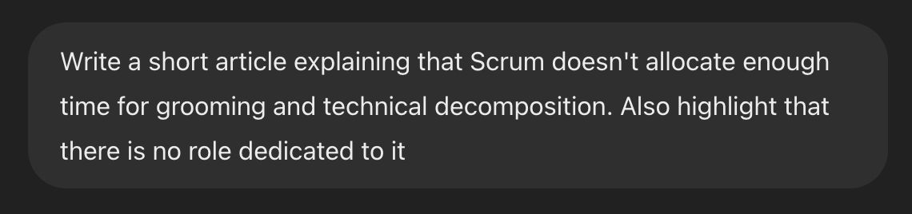

# Talking Scrum Main Pitfall with ChatGPT

Here's the prompt I gave:

## The Overlooked Aspect of Scrum.

I would gave it a harsher name.

## Insufficient Time for Grooming

This title is to soft, too. Time for grooming is not just insufficient it is simply not existing.

## Neglect of Technical Decomposition

This title is right on point. And the points are exactly correct, too. Although they suffer from being too soft, again. Teams not **may**, but **will** struggle to provide accurate estimates. Poorly decomposed tasks **will** result in ~~integration~~ challenges. And it **will** impact code quality.

## Absence of Dedicated Role

I'm not sure it needs explaining, that neither Scrum Master not Product Owner can provide a technical decomposition. Switching developer's focus on decomposition is indeed a problem on its own. However, I don't think that's **the** problem. The real problem is accountability. My belief that a **group accountability** is a bad idea in the first place. I'm afraid that a big philosophical discussion on its own. So let me just highlight that and move on.

## Conclusion

The grooming time allocation does have an implicit conflict with Scrum practices and Scrum spirit. I even feel that frequently that makes applying Scrum "as is" impossible. And I do think that Scrum **itself** should fix, instead of avoiding the issue and making people find workarounds.

