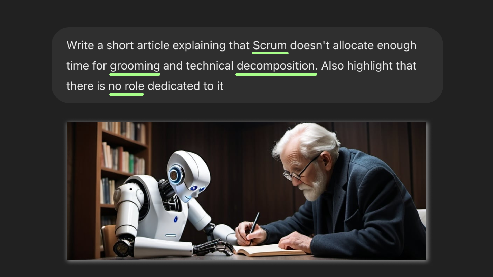
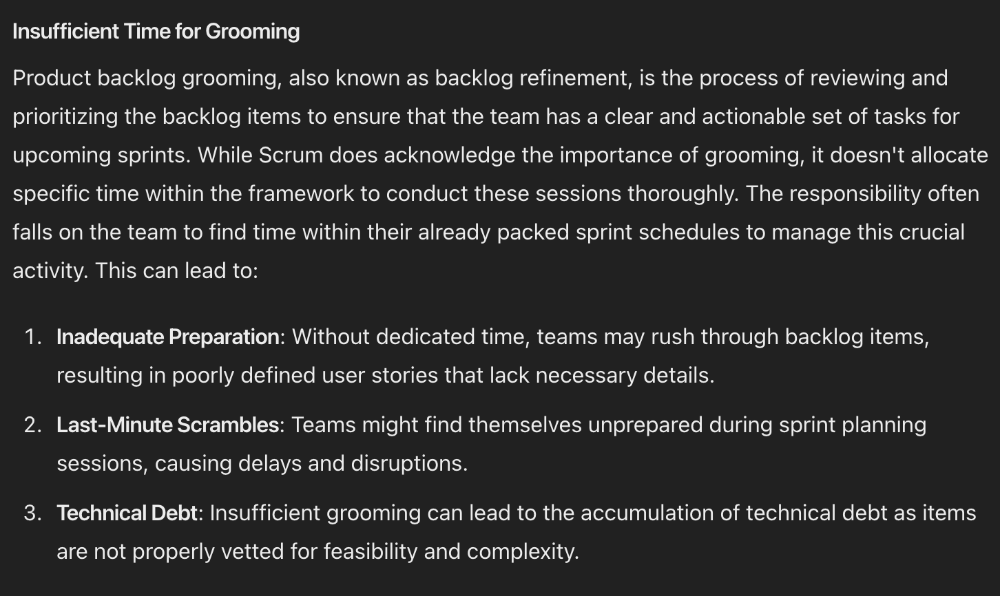
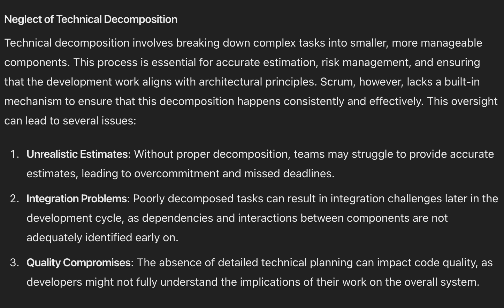
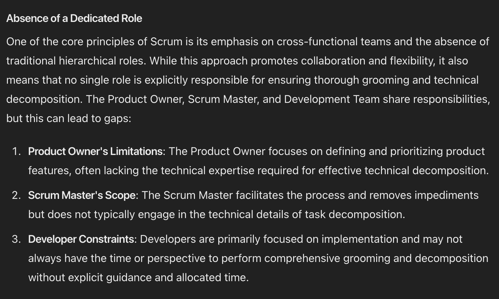
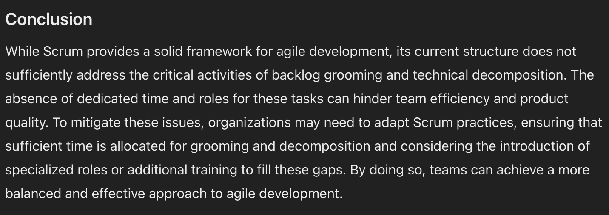

# Talking Scrum Main Pitfall with ChatGPT

During my career, I've been finding myself in a team that tries to practice Scrum to a certain degree quite a lot of time. Each team had its own set of challenges, open questions, and discussed answers. One particular topic, however, kept appearing in every team. Finally, I've decided to express my thoughts about the topic in an article. Discouragingly, I couldn't come up with a proper structure and the exact points I wanted to make. How would ChatGPT structure that? I asked myself. So, this was the prompt I gave it:

## The Overlooked Aspect

I would probably give the situation a harsher name. "Overlooked" seems too apologetic. Anyway, the introduction is generally valid. So, let's just move on to a more substantial part.

## No Time for Grooming

This title is too soft, too. Time for grooming is not just insufficient it is simply not existing. Still, the text paragraph is right on point. The following numbered list is not so precise, sadly: "Last-Minute Scrambles" seems to be a concrete example of "Inadequate Preparation", "Technical Debt" hardly can be attributed to poor Sprint Planning and I don't like the term in general. 

Instead of the numbered list, I would add the problem, that teams rarely have a "reject" button. This means that even if a team doesn't "rush through backlog items", thoroughly investigate them, and find the backlog items missing clarity, self-conflicting, or simply poorly defined, the team still doesn't have any procedure to deal with that. In my experience this results in a team member concluding that although backlog items are poorly defined we still need to move on somehow. This argument, in my estimate, mitigates the purpose of grooming in general.

## Abandoning Decomposition

Here, the initial title works almost as well as the updated one. The points made are also surprisingly precise. There's just one word I want to add. The word is "will". Teams not **may**, but **will** struggle to provide accurate estimates. Poorly decomposed tasks **will** result in ~~integration~~ challenges. Finally, neglect of technical decomposition **will** impact code quality. Besides that, a good section:

## Lack Of Accountability

I'm not sure it needs explaining, that neither Scrum Master nor Product Owner can provide a proper technical decomposition. So, I'll erase that and focus on the "Developers". Switching focus on decomposition is indeed a problem. However, I don't think it is **the** problem. The real issue, in my mind, is accountability. My belief is that **group accountability** is a bad idea in the first place. I'm afraid that is a big philosophical discussion on its own. So let me just highlight that and move on.

## The coda

In the conclusion ChatGPT goes bootlicking Scrum and leaves organizing proper planning on the organization's shoulder. In my view, the problem is an indirect consequence of Scrum itself with its utopian vision for Sprint planning. I would even argue this things make the "as-is Scrum" impractical. So my advice would be to put a discussion of how to do proper decomposition prior to organizing a "Scrum".

